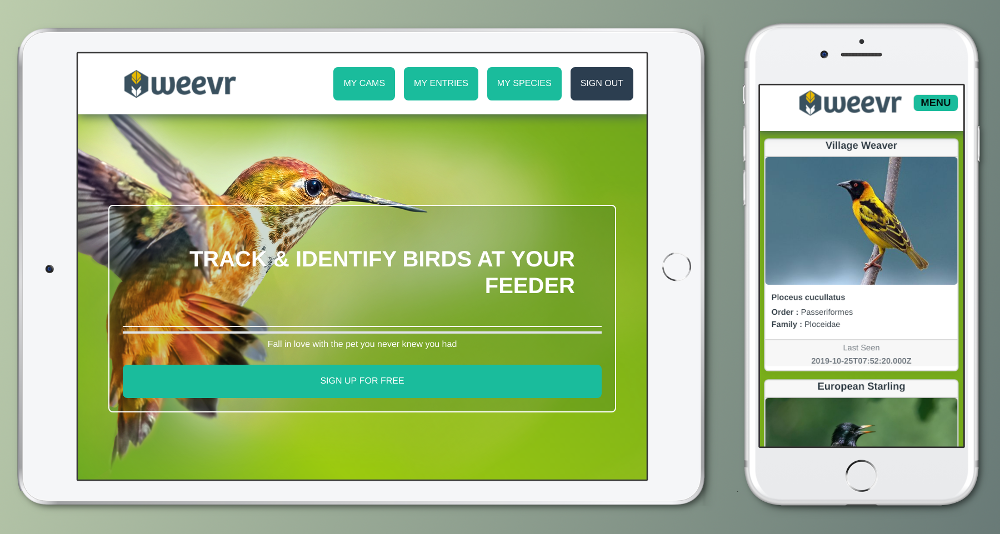
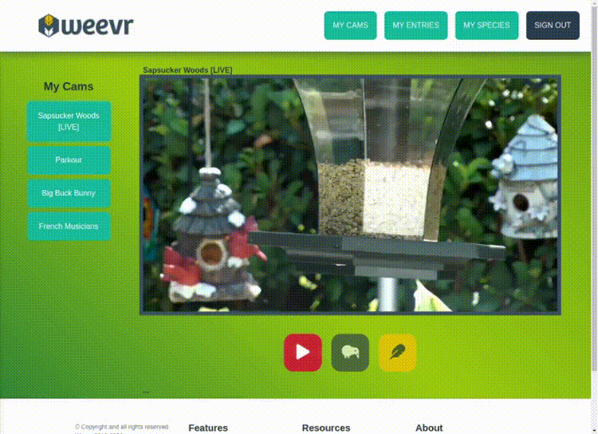
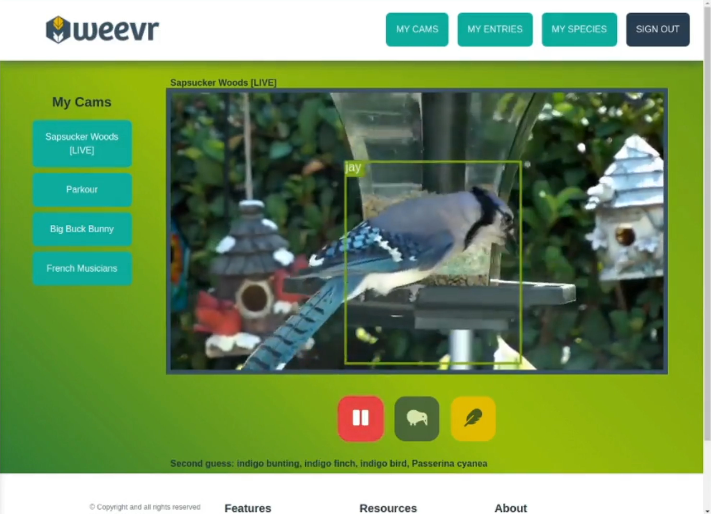
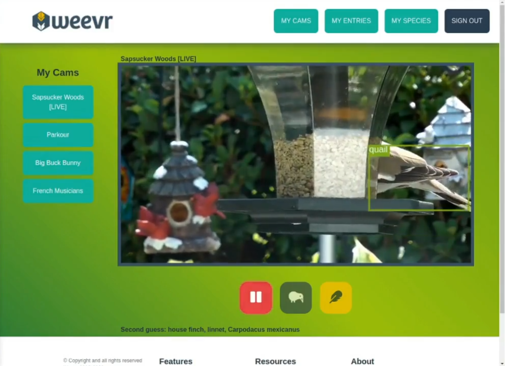
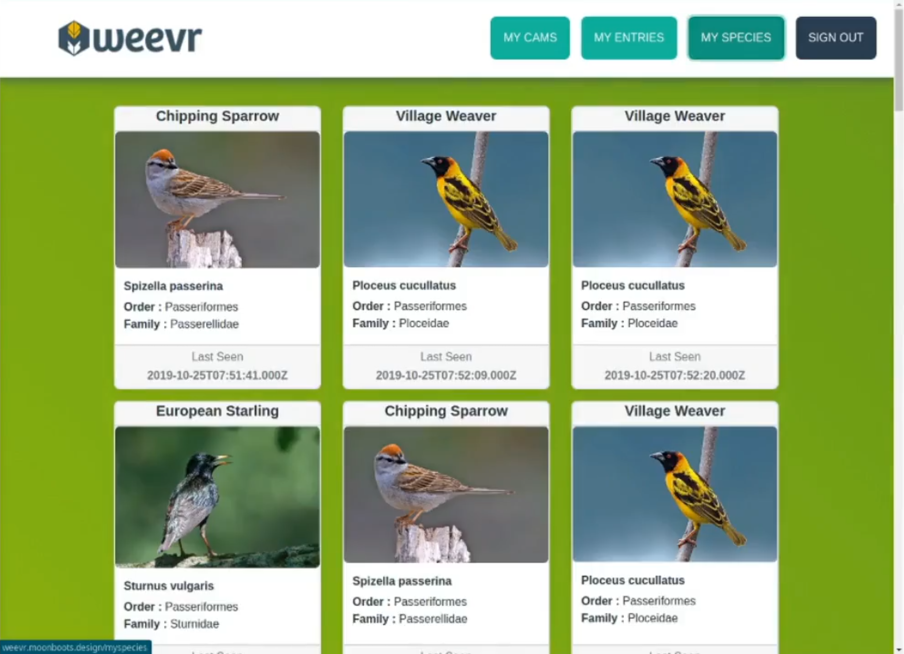

# Weevr

A web application for tracking and identifying birds at your feeder, built around TensorFlow.js running in-browser against live HLS webcam streams. Designed as a companion app for a smart bird feeder product concept.



## Demo



## Features

- Live bird feeder webcam stream integration via HLS
- Real-time bird detection using CoCo-SSD and MobileNet running entirely in-browser
- Species identification with taxonomy detail — order, family, Latin name
- Sighting log with timestamps
- Personal species catalogue per user
- User authentication via JWT
- Responsive across desktop, tablet, and mobile

## Screenshots







## Stack

React, Redux, Node.js, Express, MariaDB, TensorFlow.js, CoCo-SSD, MobileNet, HLS.js, JWT

## Running Locally

Requires Node 14 and MariaDB.

**Start the database:**

```bash
docker run --name weevr-db \
  -e MYSQL_DATABASE=birdidapp \
  -e MYSQL_USER=birdy \
  -e MYSQL_PASSWORD=W33verDB \
  -p 3306:3306 \
  -d mariadb:10.5
```

**Restore the schema:**

```bash
docker exec -i weevr-db mariadb -u birdy -pW33verDB birdidapp < birdidapp.sql
```

**Create backend/.env:**
```
DB_HOST=127.0.0.1
DB_USER=birdy
DB_PASS=W33verDB
JWT_SECRET=anystringwilldo
```

**Install and run:**

```bash
nvm use 14
npm install --legacy-peer-deps
cd backend && npm install && cd ..
npm run dev
```

Server runs at http://localhost:3000

## Status

Functional as of January 2020. Was self-hosted in production on a Linux server with the React build served statically and the Node backend running separately. Public bird feeder streams that were freely available in 2020 are now largely commercial products — a reasonable validation of the concept. Not actively maintained.
